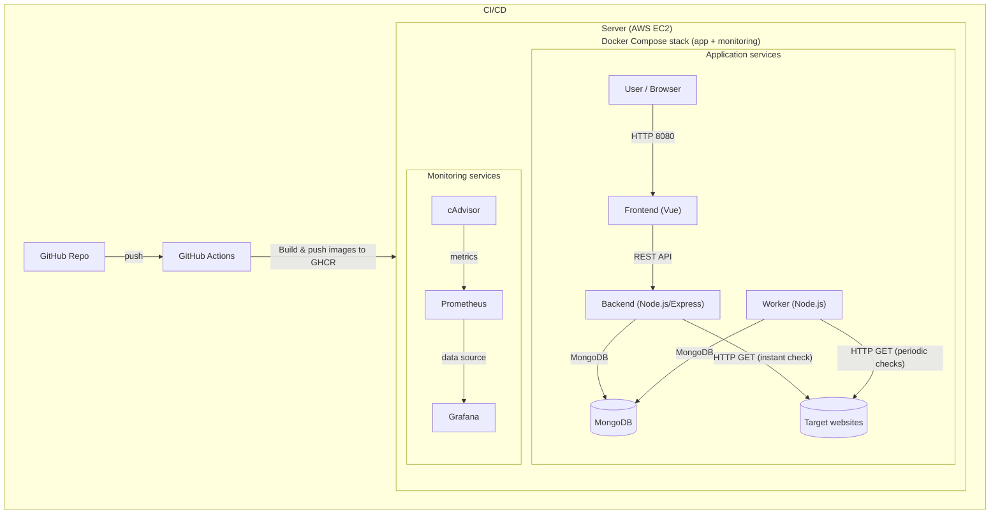

## 

### Kolegij: Praktikum

### Autor: Juraj Tojčić, Bruno Rebić

---

## CheckHTML

CheckHTML je web aplikacija za praćenje dostupnosti web stranica kroz vrijeme. Nakon što se kroz sučelje URL doda u sustav, aplikacija automatski radi provjere i sprema rezultate u bazu, pa se osim trenutnog stanja dobije i povijest (korisno kad su problemi povremeni).

Provjere se rade na dva načina:

- **inicijalno (instant check)** – odmah nakon dodavanja URL-a backend izvrši prvu provjeru i spremi rezultat
- **periodički** – worker servis u pozadini u intervalima (CHECK_INTERVAL) provjerava aktivne URL-ove i dodaje nove rezultate

Za svaku provjeru spremaju se osnovne metrike:

- **HTTP status code** (npr. 200, 404, 500)
- **HTML size** – veličina HTML odgovora (često je brzi signal da se vratio error/maintenance sadržaj)
- **Link count** – broj `<a>` tagova (indikator promjene sadržaja)
- **checkedAt** – vrijeme kada je provjera napravljena

**Zašto je korisno:** ručna provjera daje samo stanje “u tom trenutku”. U praksi stranice znaju povremeno padati ili vraćati greške (deploy, opterećenje, DNS/mreža), a povijest provjera pokazuje kad se problem dogodio i koliko često se ponavlja.

Primjeri gdje pomaže:

- povremeni padovi (500/timeout)
- provjera nakon deploya
- promjena sadržaja (HTML size/link count odskače)
- praćenje više URL-ova na jednom mjestu

## Komponente sustava

CheckHTML je organiziran kao višeservisna aplikacija:

- **Frontend (Vue)** – korisničko sučelje za dodavanje URL-ova, prikaz liste i pregled povijesti provjera. Ne pristupa bazi direktno, već komunicira s backendom putem REST API-ja.
- **Backend (Node.js/Express)** – centralni API servis. Obradom zahtjeva s frontenda upravlja URL-ovima u bazi i izvršava _instant check_ prilikom dodavanja novog URL-a.
- **Worker (Node.js)** – pozadinski servis bez API-ja. U intervalima definiranima varijablom `CHECK_INTERVAL` provjerava aktivne URL-ove i zapisuje rezultate u bazu.
- **MongoDB** – pohrana podataka (kolekcije `urls` i `checks`) za URL-ove i povijest provjera.
- **Monitoring (Prometheus + cAdvisor + Grafana)** – prikupljanje i vizualizacija metrika kontejnera i servisa (CPU, memorija, mreža) kroz dashboarde.

**Kontejnerizacija i orkestracija:** Svi servisi se pokreću kao zasebni Docker kontejneri. Orkestracija se radi preko **Docker Compose-a**, što omogućuje jednaku proceduru pokretanja lokalno i na poslužitelju bez dodatne ručne konfiguracije infrastrukture.

**Deploy i CI/CD:** Projekt uključuje **GitHub Actions** workflow za automatizirani deployment. Nakon promjena u repozitoriju, workflow se spaja na **AWS EC2** putem SSH-a te na poslužitelju izvršava ažuriranje i ponovno podizanje servisa (npr. `git pull` + `docker compose up -d --build`). Aplikacija je deployana kao **Docker Compose stack** na **AWS EC2** instanci, čime se dobiva okruženje koje je bliže produkciji i omogućuje stabilan udaljeni pristup sustavu.

### Graf arhitekture sustava



---

# Backend

Backend je centralni servis aplikacije i služi kao središnje mjesto kroz koje prolazi sva komunikacija između frontenda i baze podataka. Frontend ne pristupa bazi izravno, već sve zahtjeve šalje backendu putem REST API-ja. Backend zatim obrađuje te zahtjeve, izvršava potrebnu logiku aplikacije i po potrebi zapisuje ili dohvaća podatke iz MongoDB baze.

Backend je implementiran kao Node.js aplikacija temeljena na Express frameworku i pokreće se u vlastitom Docker kontejneru. Povezivanje s bazom podataka i ostale konfiguracije definirane su pomoću varijabli okoline, što olakšava pokretanje u Docker okruženju i kasnije na serveru.

Backend API pokriva dvije glavne funkcije:

1. **Upravljanje URL-ovima koje korisnik prati (`/urls`)**  
   Dodavanje URL-a, dohvat liste URL-ova, uređivanje i brisanje.
2. **Dohvat povijesti provjera (`/checks`)**  
   Vraća rezultate provjera za odabrani URL (inicijalne provjere koje radi backend + periodične provjere koje upisuje worker).

## Ključne funkcionalnosti backenda

## 1) Dodavanje URL-a + inicijalna provjera (instant check)

Kod dodavanja novog URL-a backend ne sprema samo URL u bazu, nego odmah izvršava i prvu provjeru dostupnosti stranice te sprema rezultat u kolekciju provjera. Time korisnik odmah dobiva početne podatke, bez čekanja workera.

**Isječak rute (POST `/urls`)**:

```js
router.post("/", async (req, res) => {
  const { url } = req.body;

  if (!url) {
    return res.status(400).json({ error: "URL is required" });
  }

  try {
    const db = await connectToDatabase();
    const urls = db.collection("urls");
    const checksCollection = db.collection("checks");

    const result = await urls.insertOne({
      url,
      isActive: true,
      createdAt: new Date(),
    });

    // INSTANT CHECK
    const checkResult = await runCheck(url);

    await checksCollection.insertOne({
      urlId: result.insertedId,
      ...checkResult,
    });

    res.status(201).json({ id: result.insertedId });
  } catch (error) {
    res.status(500).json({ error: error.message });
  }
});
CHECK_INTERVAL = 60000;
```

### Tok obrade zahtjeva:

- `url` dolazi iz `req.body` (ako nedostaje → 400)
- URL se sprema u kolekciju `urls` (`insertOne`)
- radi se `runCheck(url)` (HTTP GET + izračun metrika)
- rezultat se sprema u `checks` i veže preko `urlId`
- vraća se `201` + ID novog URL-a

---

## 2) Dohvat povijesti provjera za URL

Frontend kad korisnik klikne URL, zove backend da vrati provjere (najnovije prve).

```javascript
router.get("/:urlId", async (req, res) => {
  const { urlId } = req.params;

  try {
    const db = await connectToDatabase();
    const checks = db.collection("checks");

    const result = await checks
      .find({ urlId: new ObjectId(urlId) })
      .sort({ checkedAt: -1 })
      .toArray();

    res.json(result);
  } catch (error) {
    res.status(400).json({ error: "Invalid URL ID" });
  }
});
```

### Tok obrade zahtjeva:

- `urlId` se čita iz `req.params`
- filtrira se `checks` po `urlId`
- sortira se po `checkedAt` silazno (`-1`)
- vraća se JSON lista rezultata

  ***

## Worker

Worker je zaseban pozadinski servis koji radi neovisno o korisničkom sučelju i backendu (ne izlaže REST API). Njegov posao je automatski održavati “povijest stanja” za svaki spremljeni URL: u svakom ciklusu dohvaća aktivne URL-ove iz baze, napravi HTTP provjeru i rezultat (statusni kod, veličina HTML-a, broj linkova, vrijeme provjere) upiše u kolekciju checks. Time aplikacija dobiva periodičke zapise i onda se u UI-u vidi kako se stanje URL-a mijenjalo kroz vrijeme, čak i kad korisnik ništa ne radi.

Učestalost provjera kontrolira varijabla okoline CHECK_INTERVAL (npr. 60000 ms = 60 s), što omogućuje mijenjanje intervala bez izmjene koda — dovoljno je promijeniti .env ili docker-compose.yml.

```javascript
const CHECK_INTERVAL = Number(process.env.CHECK_INTERVAL) || 60000;

async function runChecks() {
  console.log("Worker: starting check cycle");

  try {
    const db = await connectToDatabase();
    const urlsCollection = db.collection("urls");
    const checksCollection = db.collection("checks");

    const urls = await urlsCollection.find({ isActive: true }).toArray();

    for (const urlDoc of urls) {
      const lastCheck = await checksCollection.findOne(
        { urlId: urlDoc._id },
        { sort: { checkedAt: -1 } },
      );

      if (lastCheck) {
        const diff = Date.now() - new Date(lastCheck.checkedAt).getTime();
        if (diff < CHECK_INTERVAL) {
          console.log(`⏭ Skipping ${urlDoc.url} (checked recently)`);
          continue;
        }
      }

      try {
        const response = await axios.get(urlDoc.url, { timeout: 10000 });

        const html = response.data;
        const linkCount = (html.match(/<a /g) || []).length;

        await checksCollection.insertOne({
          urlId: urlDoc._id,
          statusCode: response.status,
          htmlSize: html.length,
          linkCount,
          checkedAt: new Date(),
        });

        console.log(`✔ Checked ${urlDoc.url}`);
      } catch (err) {
        console.error(`✖ Error checking ${urlDoc.url}:`, err.message);

        await checksCollection.insertOne({
          urlId: urlDoc._id,
          statusCode: err.response?.status || 500,
          htmlSize: 0,
          linkCount: 0,
          checkedAt: new Date(),
        });
      }
    }

    console.log("Worker: cycle finished");
  } catch (err) {
    console.error("Worker fatal error:", err.message);
  }
}

// start odmah + ponavljaj periodički
runChecks();
setInterval(runChecks, CHECK_INTERVAL);
```

## Tok provjere (jedan ciklus):

- dohvaća aktivne URL-ove iz `urls`
- provjerava zadnji zapis u `checks` da ne provjerava prečesto
- radi HTTP GET i računa `statusCode`, `htmlSize`, `linkCount`
- zapisuje rezultat u `checks` (i greške isto zapisuje)

## Database (MongoDB)

MongoDB služi kao centralno spremište podataka za aplikaciju. U njoj se čuva popis URL-ova koje korisnik prati i svi rezultati provjera kroz vrijeme. Backend koristi bazu za upravljanje URL-ovima i dohvat podataka za prikaz u sučelju, dok worker periodički dodaje nove rezultate provjera.

Aplikacija koristi dvije kolekcije:

urls – sadrži URL-ove koje korisnik prati. Osim same adrese (url), tu su i osnovna polja poput isActive (je li URL uključen u provjere) i createdAt (kada je URL dodan).

checks – sadrži povijest provjera. Svaka provjera je zaseban zapis s rezultatima (statusCode, htmlSize, linkCount, checkedAt) i povezana je s URL-om preko urlId (referenca na zapis u kolekciji urls).

Ovakva struktura omogućuje da se za jedan URL jednostavno prikaže kompletna povijest provjera, a istovremeno se baza može rasti “linearno” dodavanjem novih checkova bez mijenjanja URL zapisa.

MongoDB se pokreće kao Docker servis, a podaci se čuvaju u volume-u (mongo-data)

---

## Frontend

Frontend je Vue web sučelje koje služi kao “dashboard” za praćenje URL-ova. Korisnik preko njega dodaje URL, vidi listu spremljenih URL-ova i otvara povijest provjera za odabrani URL.  
Frontend **ne komunicira s bazom direktno** – sve ide preko backend REST API-ja.

**Port:** `8080` (u Docker modu se servira preko Nginx-a)

---


---

### Što korisnik radi u sučelju

- doda novi URL za praćenje
- vidi listu svih spremljenih URL-ova
- klikne URL i dobije tablicu provjera (zadnje provjere prve)
- može urediti ili obrisati URL

---

### Kako frontend priča s backendom

Sve API pozive frontend radi preko Axios clienta u `services/api.js`. Tu je definirana osnovna adresa backenda (`baseURL`), tako da ostatak koda samo poziva `/urls` i `/checks/...`.

```js
const api = axios.create({
  baseURL: import.meta.env.VITE_API_URL || "http://localhost:3000",
  timeout: 5000,
});

export default api;
```

---

### Komponente i što točno rade

- **UrlForm.vue**  
  Šalje `POST /urls` kad korisnik doda novi URL. Nakon toga osvježi listu URL-ova.

- **UrlList.vue**  
  Prikazuje listu URL-ova i omogućuje:
  - `PUT /urls/:id` (uređivanje URL-a)
  - `DELETE /urls/:id` (brisanje URL-a)
  - klik na URL → emit `select` (otvara provjere za taj URL)

- **CheckList.vue**  
  Prikazuje tablicu provjera koje dolaze iz `GET /checks/:urlId` (status, veličina HTML-a, broj linkova, vrijeme provjere).

---

### App.vue: spajanje svega + osvježavanje provjera

`App.vue` drži stanje aplikacije (`urls`, `selectedUrl`, `checks`) i poziva backend:

- `GET /urls` za popis URL-ova
- `GET /checks/:urlId` za provjere odabranog URL-a

Kad korisnik odabere URL, frontend radi **polling** svakih 10 sekundi (`setInterval(loadChecks, 10000)`) kako bi se u tablici vidjele i nove provjere koje worker upisuje u bazu.

## Docker (kontejnerizacija i orkestracija)

Projekt je složen kao više servisa (frontend, backend, worker, baza i monitoring) koji se pokreću u zasebnim Docker kontejnerima. To je praktično u DevOps kontekstu jer se cijeli sustav može podignuti jednako lokalno i na serveru, bez ručnog instaliranja baza i alata.

### Pojmovi

- **Dockerfile** je “recept” kako se gradi image za naš servis.
- **Docker image** je zapakirana aplikacija (kod + runtime + ovisnosti).
- **Container** je pokrenuti image (runtime instanca).

U ovom projektu Dockerfile koristimo za servise koje gradimo iz vlastitog koda (`backend`, `worker`, `frontend`). Za MongoDB i monitoring koristimo gotove službene image-e pa za njih ne trebaju Dockerfile-ovi.

### Primjer Dockerfile-a (backend)

```dockerfile
FROM node:18-alpine
WORKDIR /app
COPY package*.json ./
RUN npm install
COPY . .
EXPOSE 3000
CMD ["npm", "start"]
```

Ovaj primjer pokazuje tipičan pattern: uzme se baza (Node), instaliraju se dependencyji, kopira kod i definira naredba za pokretanje servisa.

---

# Docker Compose

Docker Compose služi za pokretanje cijelog sustava jednom naredbom. U `docker-compose.yml` su definirani svi servisi aplikacije i infrastrukture (baza + monitoring).

## `docker-compose.yml` (glavna konfiguracija)

```yaml
version: "3.9"

services:
  mongo:
    image: mongo:6
    container_name: checkhtml-mongo
    restart: always
    ports:
      - "27017:27017"
    volumes:
      - mongo-data:/data/db

  backend:
    build: ./backend
    container_name: checkhtml-backend
    restart: always
    ports:
      - "3000:3000"
    environment:
      MONGO_URI: mongodb://mongo:27017
      MONGO_DB_NAME: CheckHTML-DB
    depends_on:
      - mongo

  worker:
    build: ./worker
    container_name: checkhtml-worker
    restart: always
    environment:
      MONGO_URI: mongodb://mongo:27017
      MONGO_DB_NAME: CheckHTML-DB
      CHECK_INTERVAL: 60000
    depends_on:
      - mongo

  frontend:
    build: ./frontend
    container_name: checkhtml-frontend
    restart: always
    ports:
      - "8080:80"
    depends_on:
      - backend

  prometheus:
    image: prom/prometheus:latest
    container_name: checkhtml-prometheus
    restart: unless-stopped
    ports:
      - "9090:9090"
    volumes:
      - ./monitoring/prometheus.yml:/etc/prometheus/prometheus.yml:ro
      - prometheus-data:/prometheus

  cadvisor:
    image: gcr.io/cadvisor/cadvisor:latest
    container_name: checkhtml-cadvisor
    restart: unless-stopped
    ports:
      - "8081:8080"
    volumes:
      - /:/rootfs:ro
      - /var/run:/var/run:rw
      - /sys:/sys:ro
      - /var/lib/docker/:/var/lib/docker:ro

  grafana:
    image: grafana/grafana:latest
    container_name: checkhtml-grafana
    restart: unless-stopped
    depends_on:
      - prometheus
    ports:
      - "3001:3000"
    environment:
      GF_SECURITY_ADMIN_USER: admin
      GF_SECURITY_ADMIN_PASSWORD: admin123
    volumes:
      - grafana-data:/var/lib/grafana

volumes:
  mongo-data:
  prometheus-data:
  grafana-data:
```

### Servisi aplikacije

- **backend** (`build: ./backend`)  
  gradi se iz našeg koda i izlaže API na `3000`. Spaja se na Mongo preko `MONGO_URI=mongodb://mongo:27017`.

- **worker** (`build: ./worker`)  
  gradi se iz našeg koda, nema portove jer ne izlaže HTTP. Periodičke provjere radi prema `CHECK_INTERVAL`.

- **frontend** (`build: ./frontend`)  
  gradi se iz našeg koda, ali se u runtimeu servira statički (Nginx), zato je mapiranje `8080:80`.

### Infrastruktura

- **mongo** (`image: mongo:6`)  
  koristi gotovi official image i podatke sprema u volume `mongo-data` (da ostanu i nakon restarta).

- **prometheus** (`image: prom/prometheus`)  
  prikuplja metrike. Konfiguracija je u `monitoring/prometheus.yml` i mounta se u container.

- **cadvisor** (`image: gcr.io/cadvisor/cadvisor`)  
  izvor metrika o Docker kontejnerima (CPU/memorija/mreža). Zato ima mountove prema Docker hostu.

- **grafana** (`image: grafana/grafana`)  
  UI za dashboarde. Spaja se na Prometheus kao data source (unutar docker mreže: `http://prometheus:9090`).

### Volume

Volumes služe za **trajnu pohranu podataka** iz kontejnera. Bez volume-a, podaci bi bili izgubljeni čim se kontejner obriše ili napravi novi (`docker compose down` + novi `up`).

- `mongo-data` čuva MongoDB podatke trajno
- `prometheus-data` čuva Prometheus metrike
- `grafana-data` čuva Grafana postavke/dashboarde

---

## Pokretanje (lokalno)

```bash
docker compose up --build
```

## Gašenje

```bash
docker compose down
```

**Napomena**: `docker compose down -v` briše i volumene (podatke), pa oprez.

---

## Monitoring (Prometheus + cAdvisor + Grafana)

U projektu je dodan monitoring da se može pratiti kako se Docker kontejneri ponašaju tijekom rada (CPU, memorija, mreža) i da se sustav može promatrati “DevOps” načinom, a ne samo kroz to radi li aplikacija ili ne.

Poanta nije samo vidjeti da je servis up, nego i **kako se ponaša pod opterećenjem**:

- troši li backend previše memorije (mogući memory leak)
- skače li CPU kod workera kad radi ciklus provjera
- je li promet (network) veći nego što se očekuje
- je li se neki kontejner restartao ili “šteka”

Monitoring stack se diže zajedno s aplikacijom preko `docker-compose.yml`, tako da se sve dobije odmah nakon `docker compose up`.

**Tok metrika:** `cAdvisor` → `Prometheus` → `Grafana`

---

### Što je što (uloge komponenti)

- **cAdvisor**  
  Skuplja metrike o Docker kontejnerima (npr. CPU/memorija/network). On je izvor podataka za kontejnere.

- **Prometheus**  
  Periodički “scrapea” metrike (uzima ih preko HTTP endpointa) i sprema ih u svoju bazu metrika.

- **Grafana**  
  UI za vizualizaciju. U Grafani se kao _data source_ postavi Prometheus i onda se rade dashboardi.

> Zašto je cAdvisor tu?  
> Prometheus sam po sebi ne zna metrike kontejnera. Treba mu “exporter” koji te metrike izlaže. U ovom projektu cAdvisor radi tu ulogu.

> Zašto Grafana ako cAdvisor već ima UI?  
> cAdvisor UI je dobar za brzi “live” pregled i debug, ali Grafana je bolja za pregled trendova kroz vrijeme, usporedbu više metrika na jednom mjestu i izradu dashboarda (plus kasnije alerting).

---

### Gdje se nalazi konfiguracija

- `monitoring/prometheus.yml` – Prometheus konfiguracija (scrape targeti)
- `docker-compose.yml` – definicija servisa `prometheus`, `cadvisor`, `grafana`

---

### Prometheus konfiguracija (monitoring/prometheus.yml)

```yaml
global:
  scrape_interval: 5s
  evaluation_interval: 5s
  external_labels:
    project: "checkhtml-monitoring"

scrape_configs:
  - job_name: "prometheus"
    static_configs:
      - targets: ["prometheus:9090"]

  - job_name: "cadvisor"
    static_configs:
      - targets: ["cadvisor:8080"]
```

- `scrape_interval: 5s` znači da Prometheus uzima metrike svakih 5 sekundi
- targeti koriste Docker hostnames (`prometheus`, `cadvisor`) jer su svi servisi u istoj Docker mreži

  ***

  ## Kako otvoriti i provjeriti monitoring

### 1) Prometheus

- Otvori: http://localhost:9090
- Idi na **Status → Targets**
- Provjeri da su `prometheus` i `cadvisor` u stanju **UP**

### 2) cAdvisor

- Otvori: http://localhost:8081
- Tu se može vidjeti stanje kontejnera i osnovne metrike po kontejneru

### 3) Grafana

- Otvori: http://localhost:3001
- Login: `admin` / `admin123`

**Dodavanje Prometheus data source-a:**

- URL (unutar Docker mreže): `http://prometheus:9090`

Nakon toga se može importati dashboard (ili složiti svoj) za prikaz CPU/memorije/mreže po kontejnerima.

---

## Zašto monitoring servisi nemaju Dockerfile?

MongoDB, Prometheus, Grafana i cAdvisor nemaju Dockerfile u repozitoriju jer se koriste gotovi službeni image-i:

- `mongo:6`
- `prom/prometheus:latest`
- `grafana/grafana:latest`
- `gcr.io/cadvisor/cadvisor:latest`

Konfiguracija se radi kroz `docker-compose.yml` (portovi, env varijable, volume mountovi) i kroz config datoteke (npr. `monitoring/prometheus.yml`).

## CI/CD – Continuous Delivery

U sklopu projekta implementiran je **CI/CD pipeline** s ciljem automatizacije procesa izgradnje aplikacije i njene pripreme za pokretanje u produkcijskom okruženju.  
Naglasak je stavljen na **Continuous Delivery (CD)**, gdje se svaka promjena koda automatski priprema za deployment, dok se samo pokretanje aplikacije na serveru odvija kontrolirano.

### Što CI/CD znači u ovom projektu?

- **Continuous Integration (CI)**  
  Svaka promjena koda (push na `main` granu) automatski pokreće CI proces:
  - izgradnju Docker image-a za svaki servis (`backend`, `worker`, `frontend`)
  - provjeru da se aplikacija može uspješno zapakirati i pokrenuti u Docker okruženju

- **Continuous Delivery (CD)**  
  Nakon uspješne izgradnje:
  - Docker image-i se objavljuju u **GitHub Container Registry (GHCR)**
  - image-i su odmah spremni za deployment na server

Na ovaj način se osigurava da je svaka verzija aplikacije **uvijek spremna za produkciju**, bez potrebe za ručnim buildanjem na serveru.

---

## GitHub Actions pipeline

CI/CD pipeline je implementiran pomoću **GitHub Actions**.  
Workflow je definiran u `.github/workflows/` direktoriju i automatski se pokreće prilikom `push`-a na `main` granu.

Pipeline za svaki servis aplikacije (`backend`, `worker`, `frontend`) izvršava sljedeće korake:

1. preuzimanje izvornog koda iz GitHub repozitorija
2. izgradnju Docker image-a pomoću pripadajućeg Dockerfile-a
3. označavanje image-a (`latest` i SHA hash commit-a)
4. objavu image-a u GitHub Container Registry

Primjeri objavljenih image-a:

- `ghcr.io/<username>/checkhtml-backend:latest`
- `ghcr.io/<username>/checkhtml-worker:latest`
- `ghcr.io/<username>/checkhtml-frontend:latest`

Ovakav pristup omogućuje verzioniranje image-a i jednostavan rollback na prethodne verzije ako je potrebno.

---

## GitHub Container Registry (GHCR)

GitHub Container Registry koristi se kao centralno spremište Docker image-a.

Prednosti korištenja GHCR-a:

- image-i su direktno vezani uz GitHub repozitorij
- nema potrebe za dodatnim registry serverom
- jednostavna autentikacija pomoću GitHub tokena
- praktično rješenje za CI/CD u DevOps projektima

---

## Deployment na server (AWS EC2)

Aplikacija je deployana na **AWS EC2 virtualni server**, čime je osigurano realno produkcijsko okruženje.

Osnovna ideja deploymenta je da:

- server koristi isključivo **gotove Docker image-e** iz GHCR-a
- build procesa nema na serveru

Na taj način se jasno razdvaja razvoj aplikacije (lokalno + CI) od njenog izvođenja (server).

---

## docker-compose.server.yml

Za produkcijski deployment koristi se zasebna Docker Compose konfiguracija (`docker-compose.server.yml`).

Za razliku od lokalne konfiguracije:

- ne koristi se `build`
- koriste se `image` reference prema GHCR-u

Primjer (skraćeno):

```yaml
services:
  backend:
    image: ghcr.io/<username>/checkhtml-backend:latest
    restart: always
    ports:
      - "3000:3000"

  worker:
    image: ghcr.io/<username>/checkhtml-worker:latest
    restart: always

  frontend:
    image: ghcr.io/<username>/checkhtml-frontend:latest
    restart: always
    ports:
      - "8080:80"
```

Ovakav pristup omogućuje brz i pouzdan deployment bez potrebe za buildanjem aplikacije na serveru.

---

## Povezivanje na server (SSH)

Pristup EC2 instanci ide preko **SSH-a**. Tipični workflow je spajanje na server, dohvat koda preko Git-a i pokretanje Docker Compose stacka.

Primjer spajanja pomoću SSH ključa:

```bash
ssh -i /path/to/key.pem ec2-user@EC2_PUBLIC_IP
```

Na serveru je preporučljivo provjeriti dostupnost osnovnih alata prije pokretanja sustava:

```bash
docker --version
docker compose version
git --version
```

---

## Postupak deploya na server

Na AWS EC2 serveru deployment se provodi sljedećim koracima:

1. Instalacija Dockera i Docker Compose-a
2. Povlačenje najnovijih image-a i pokretanje aplikacije:
   ```bash
   docker-compose -f docker-compose.server.yml pull
   docker-compose -f docker-compose.server.yml up -d
   ```

Ako dođe do nove verzije aplikacije:

- CI pipeline automatski izgradi i objavi nove image-e
- server povuče nove image-e i restartira kontejnere

---

## Pristup aplikaciji

Ako su portovi otvoreni u **Security Group** postavkama, servisi su dostupni direktno preko javne IP adrese EC2 instance (u našem slučaju 63.179.145.215):

- **Frontend:** `http://<EC2_PUBLIC_IP>:8080`
- **Backend API:** `http://<EC2_PUBLIC_IP>:3000`
- **Grafana:** `http://<EC2_PUBLIC_IP>:3001`
- **Prometheus:** `http://<3EC2_PUBLIC_IP>:9090`
- **cAdvisor:** `http://<EC2_PUBLIC_IP>:8081`

````

**Default login podaci:**

```text
Username: admin
Password: admin123
````

---

### Sigurnosna napomena

MongoDB servis nije javno izložen i dostupan je isključivo unutar Docker mreže, čime se sprječava izravan pristup bazi izvan servera.

Monitoring portovi su otvoreni radi demonstracije i razvoja; u produkcijskom okruženju pristup bi bio ograničen putem firewall pravila ili autentikacije.

---

## Zašto Continuous Delivery, a ne Continuous Deployment?

U ovom projektu implementiran je **Continuous Delivery**, a ne Continuous Deployment, jer:

- pipeline automatski priprema svaku novu verziju aplikacije
- deployment na server se pokreće ručno
- postoji potpuna kontrola nad trenutkom deploya

Ovakav pristup smanjuje rizik i često se koristi u stvarnim DevOps okruženjima.

---

## Demo video aplikacije

https://www.youtube.com/watch?v=gG6IPpVO31M
