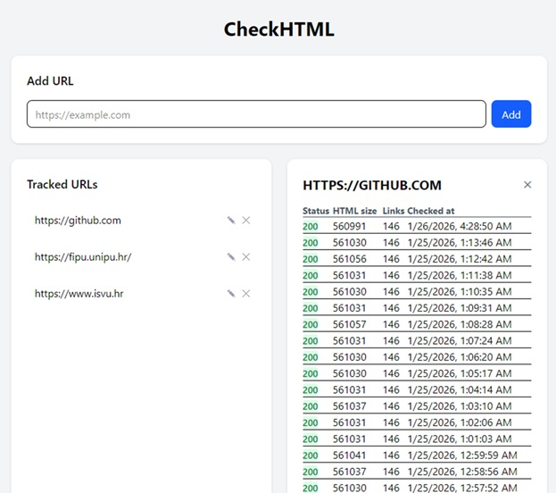

---
### Kolegij: Praktikum

### Autor: Juraj Tojčić, Bruno Rebić
---

# CheckHTML – URL Monitoring Application

CheckHTML je web aplikacija za praćenje dostupnosti web stranica. Korisnik unosi URL koji želi pratiti, a aplikacija periodički prikuplja osnovne informacije o svakoj provjeri, poput HTTP statusnog koda, veličine HTML dokumenta i broja poveznica na stranici.

Aplikacija je podijeljena na više komponenti kako bi se jasno razdvojile odgovornosti i pojednostavilo održavanje sustava.

## Komponente sustava

- **Frontend** – web sučelje koje omogućuje unos URL-ova, prikaz liste praćenih URL-ova i pregled rezultata provjera. Frontend komunicira s backendom putem REST API-ja.
- **Backend** – Node.js (Express) aplikacija koja izlaže REST API za upravljanje URL-ovima i dohvat rezultata provjera. Prilikom dodavanja novog URL-a backend izvršava inicijalnu provjeru i sprema prvi rezultat u bazu.
- **Worker** – pozadinski servis koji u definiranim vremenskim intervalima provjerava sve aktivne URL-ove i sprema nove rezultate provjera u bazu podataka.
- **Baza podataka (MongoDB)** – služi za pohranu URL-ova i povijesti njihovih provjera.
- **Monitoring** – sustav za praćenje rada aplikacije i Docker kontejnera, temeljen na alatima Prometheus, cAdvisor i Grafana.

Cijeli sustav implementiran je kao skup Docker kontejnera, pri čemu svaka komponenta radi u vlastitom kontejneru. Orkestracija kontejnera provodi se pomoću alata Docker Compose, koji omogućuje jednostavno pokretanje i upravljanje svim dijelovima aplikacije.

Predviđeno je daljnje proširenje sustava kroz CI/CD pipeline i pokretanje na udaljenom poslužitelju (AWS EC2), kako bi se dobilo realnije produkcijsko okruženje.

---

# Backend

Backend je centralni servis aplikacije i služi kao središnje mjesto kroz koje prolazi sva komunikacija između frontenda i baze podataka. Frontend ne pristupa bazi izravno, već sve zahtjeve šalje backendu putem REST API-ja. Backend zatim obrađuje te zahtjeve, izvršava potrebnu logiku aplikacije i po potrebi zapisuje ili dohvaća podatke iz MongoDB baze.

Backend je implementiran kao Node.js aplikacija temeljena na Express frameworku i pokreće se u vlastitom Docker kontejneru. Povezivanje s bazom podataka i ostale konfiguracije definirane su pomoću varijabli okoline, što olakšava pokretanje u Docker okruženju i kasnije na serveru.

Backend API pokriva dvije glavne funkcije:

1. **Upravljanje URL-ovima koje korisnik prati (`/urls`)**  
   Dodavanje URL-a, dohvat liste URL-ova, uređivanje i brisanje.
2. **Dohvat povijesti provjera (`/checks`)**  
   Vraća rezultate provjera za odabrani URL (inicijalne provjere koje radi backend + periodične provjere koje upisuje worker).

## Ključne funkcionalnosti backenda

## 1) Dodavanje URL-a + inicijalna provjera (instant check)

Kod dodavanja novog URL-a backend ne sprema samo URL u bazu, nego odmah izvršava i prvu provjeru dostupnosti stranice te sprema rezultat u kolekciju provjera. Time korisnik odmah dobiva početne podatke, bez čekanja workera.

**Isječak rute (POST `/urls`)**:

```js
router.post("/", async (req, res) => {
  const { url } = req.body;

  if (!url) {
    return res.status(400).json({ error: "URL is required" });
  }

  try {
    const db = await connectToDatabase();
    const urls = db.collection("urls");
    const checksCollection = db.collection("checks");

    const result = await urls.insertOne({
      url,
      isActive: true,
      createdAt: new Date(),
    });

    // INSTANT CHECK
    const checkResult = await runCheck(url);

    await checksCollection.insertOne({
      urlId: result.insertedId,
      ...checkResult,
    });

    res.status(201).json({ id: result.insertedId });
  } catch (error) {
    res.status(500).json({ error: error.message });
  }
});
CHECK_INTERVAL=60000
```

## U srži:

- `url` dolazi iz `req.body` (ako nedostaje → 400)
- URL se sprema u kolekciju `urls` (`insertOne`)
- radi se `runCheck(url)` (HTTP GET + izračun metrika)
- rezultat se sprema u `checks` i veže preko `urlId`
- vraća se `201` + ID novog URL-a

---

## Ključna funkcionalnost 2 – Dohvat povijesti provjera za URL

Frontend kad korisnik klikne URL, zove backend da vrati provjere (najnovije prve).

```javascript
router.get("/:urlId", async (req, res) => {
  const { urlId } = req.params;

  try {
    const db = await connectToDatabase();
    const checks = db.collection("checks");

    const result = await checks
      .find({ urlId: new ObjectId(urlId) })
      .sort({ checkedAt: -1 })
      .toArray();

    res.json(result);
  } catch (error) {
    res.status(400).json({ error: "Invalid URL ID" });
  }
});
```

## U srži:

- `urlId` se čita iz `req.params`
- filtrira se `checks` po `urlId`
- sortira se po `checkedAt` silazno (`-1`)
- vraća se JSON lista rezultata

  ---

## Worker

Worker je pozadinski servis (nema REST API). Njegova uloga je da u pravilnim intervalima provjerava URL-ove i upisuje rezultate u bazu, čak i kad korisnik ne koristi frontend.

Interval provjera kontrolira varijabla `CHECK_INTERVAL`.

```javascript
const CHECK_INTERVAL = Number(process.env.CHECK_INTERVAL) || 60000;

async function runChecks() {
  console.log("Worker: starting check cycle");

  try {
    const db = await connectToDatabase();
    const urlsCollection = db.collection("urls");
    const checksCollection = db.collection("checks");

    const urls = await urlsCollection.find({ isActive: true }).toArray();

    for (const urlDoc of urls) {
      const lastCheck = await checksCollection.findOne(
        { urlId: urlDoc._id },
        { sort: { checkedAt: -1 } }
      );

      if (lastCheck) {
        const diff = Date.now() - new Date(lastCheck.checkedAt).getTime();
        if (diff < CHECK_INTERVAL) {
          console.log(`⏭ Skipping ${urlDoc.url} (checked recently)`);
          continue;
        }
      }

      try {
        const response = await axios.get(urlDoc.url, { timeout: 10000 });

        const html = response.data;
        const linkCount = (html.match(/<a /g) || []).length;

        await checksCollection.insertOne({
          urlId: urlDoc._id,
          statusCode: response.status,
          htmlSize: html.length,
          linkCount,
          checkedAt: new Date(),
        });

        console.log(`✔ Checked ${urlDoc.url}`);
      } catch (err) {
        console.error(`✖ Error checking ${urlDoc.url}:`, err.message);

        await checksCollection.insertOne({
          urlId: urlDoc._id,
          statusCode: err.response?.status || 500,
          htmlSize: 0,
          linkCount: 0,
          checkedAt: new Date(),
        });
      }
    }

    console.log("Worker: cycle finished");
  } catch (err) {
    console.error("Worker fatal error:", err.message);
  }
}

// start odmah + ponavljaj periodički
runChecks();
setInterval(runChecks, CHECK_INTERVAL);
```

## U srži:

- dohvaća aktivne URL-ove iz `urls` 
- provjerava zadnji zapis u `checks` da ne provjerava prečesto
- radi HTTP GET i računa `statusCode`, `htmlSize`, `linkCount`
- zapisuje rezultat u `checks` (i greške isto zapisuje)

## Database (MongoDB)

MongoDB se koristi za pohranu podataka i dijeli se između backenda i workera.

Kolekcije:

- urls – URL-ovi koje korisnik prati (`url`, `isActive`, `createdAt`)
- checks – povijest provjera (`urlId`, `statusCode`, `htmlSize`, `linkCount`, `checkedAt`)

MongoDB se pokreće kao Docker servis, a podaci se čuvaju u volume-u (mongo-data) da ostanu nakon restarta.

---


## Frontend

Frontend je Vue web sučelje koje služi kao “dashboard” za praćenje URL-ova. Korisnik preko njega dodaje URL, vidi listu spremljenih URL-ova i otvara povijest provjera za odabrani URL.  
Frontend **ne komunicira s bazom direktno** – sve ide preko backend REST API-ja.

**Port:** `8080` (u Docker modu se servira preko Nginx-a)

---



---

### Što korisnik radi u sučelju

- doda novi URL za praćenje  
- vidi listu svih spremljenih URL-ova  
- klikne URL i dobije tablicu provjera (zadnje provjere prve)  
- može urediti ili obrisati URL  

---

### Kako frontend priča s backendom

Sve API pozive frontend radi preko Axios clienta u `services/api.js`. Tu je definirana osnovna adresa backenda (`baseURL`), tako da ostatak koda samo poziva `/urls` i `/checks/...`.

```js
const api = axios.create({
  baseURL: import.meta.env.VITE_API_URL || "http://localhost:3000",
  timeout: 5000,
});

export default api;
```
---

### Komponente i što točno rade

- **UrlForm.vue**  
  Šalje `POST /urls` kad korisnik doda novi URL. Nakon toga osvježi listu URL-ova.

- **UrlList.vue**  
  Prikazuje listu URL-ova i omogućuje:
  - `PUT /urls/:id` (uređivanje URL-a)
  - `DELETE /urls/:id` (brisanje URL-a)
  - klik na URL → emit `select` (otvara provjere za taj URL)

- **CheckList.vue**  
  Prikazuje tablicu provjera koje dolaze iz `GET /checks/:urlId` (status, veličina HTML-a, broj linkova, vrijeme provjere).

---

### App.vue: spajanje svega + osvježavanje provjera

`App.vue` drži stanje aplikacije (`urls`, `selectedUrl`, `checks`) i poziva backend:
- `GET /urls` za popis URL-ova
- `GET /checks/:urlId` za provjere odabranog URL-a

Kad korisnik odabere URL, frontend radi **polling** svakih 10 sekundi (`setInterval(loadChecks, 10000)`) kako bi se u tablici vidjele i nove provjere koje worker upisuje u bazu.


## Docker i Docker compose

Projekt je složen kao više servisa (frontend, backend, worker, baza i monitoring) koji se pokreću u zasebnim Docker kontejnerima. To je praktično u DevOps kontekstu jer se cijeli sustav može podignuti jednako lokalno i na serveru, bez ručnog instaliranja baza i alata.

### Docker (kratko)

- **Dockerfile** je recept kako se gradi image za naš servis.
- **Docker image** je spakirana aplikacija (kod + runtime + ovisnosti).
- **Container** je pokrenuti image.

U ovom projektu Dockerfile koristimo za servise koje gradimo iz vlastitog koda (`backend`, `worker`, `frontend`). Za MongoDB i monitoring koristimo gotove službene image-e pa za njih ne trebaju Dockerfile-ovi.

### Primjer Dockerfile-a (backend)

```dockerfile
FROM node:18-alpine
WORKDIR /app
COPY package*.json ./
RUN npm install
COPY . .
EXPOSE 3000
CMD ["npm", "start"]
```
Ovaj primjer pokazuje tipičan pattern: uzme se baza (Node), instaliraju se dependencyji, kopira kod i definira naredba za pokretanje servisa.

---

# Docker Compose

Docker Compose služi za pokretanje cijelog sustava jednom naredbom. U `docker-compose.yml` su definirani svi servisi aplikacije i infrastrukture (baza + monitoring).

## `docker-compose.yml` (glavna konfiguracija)

```yaml
version: "3.9"

services:
  mongo:
    image: mongo:6
    container_name: checkhtml-mongo
    restart: always
    ports:
      - "27017:27017"
    volumes:
      - mongo-data:/data/db

  backend:
    build: ./backend
    container_name: checkhtml-backend
    restart: always
    ports:
      - "3000:3000"
    environment:
      MONGO_URI: mongodb://mongo:27017
      MONGO_DB_NAME: CheckHTML-DB
    depends_on:
      - mongo

  worker:
    build: ./worker
    container_name: checkhtml-worker
    restart: always
    environment:
      MONGO_URI: mongodb://mongo:27017
      MONGO_DB_NAME: CheckHTML-DB
      CHECK_INTERVAL: 60000
    depends_on:
      - mongo

  frontend:
    build: ./frontend
    container_name: checkhtml-frontend
    restart: always
    ports:
      - "8080:80"
    depends_on:
      - backend

  prometheus:
    image: prom/prometheus:latest
    container_name: checkhtml-prometheus
    restart: unless-stopped
    ports:
      - "9090:9090"
    volumes:
      - ./monitoring/prometheus.yml:/etc/prometheus/prometheus.yml:ro
      - prometheus-data:/prometheus

  cadvisor:
    image: gcr.io/cadvisor/cadvisor:latest
    container_name: checkhtml-cadvisor
    restart: unless-stopped
    ports:
      - "8081:8080"
    volumes:
      - /:/rootfs:ro
      - /var/run:/var/run:rw
      - /sys:/sys:ro
      - /var/lib/docker/:/var/lib/docker:ro

  grafana:
    image: grafana/grafana:latest
    container_name: checkhtml-grafana
    restart: unless-stopped
    depends_on:
      - prometheus
    ports:
      - "3001:3000"
    environment:
      GF_SECURITY_ADMIN_USER: admin
      GF_SECURITY_ADMIN_PASSWORD: admin123
    volumes:
      - grafana-data:/var/lib/grafana

volumes:
  mongo-data:
  prometheus-data:
  grafana-data:
```
### Servisi aplikacije

- **backend** (`build: ./backend`)  
  gradi se iz našeg koda i izlaže API na `3000`. Spaja se na Mongo preko `MONGO_URI=mongodb://mongo:27017`.

- **worker** (`build: ./worker`)  
  gradi se iz našeg koda, nema portove jer ne izlaže HTTP. Periodičke provjere radi prema `CHECK_INTERVAL`.

- **frontend** (`build: ./frontend`)  
  gradi se iz našeg koda, ali se u runtimeu servira statički (Nginx), zato je mapiranje `8080:80`.

### Infrastruktura

- **mongo** (`image: mongo:6`)  
  koristi gotovi official image i podatke sprema u volume `mongo-data` (da ostanu i nakon restarta).

- **prometheus** (`image: prom/prometheus`)  
  prikuplja metrike. Konfiguracija je u `monitoring/prometheus.yml` i mounta se u container.

- **cadvisor** (`image: gcr.io/cadvisor/cadvisor`)  
  izvor metrika o Docker kontejnerima (CPU/memorija/mreža). Zato ima mountove prema Docker hostu.

- **grafana** (`image: grafana/grafana`)  
  UI za dashboarde. Spaja se na Prometheus kao data source (unutar docker mreže: `http://prometheus:9090`).

### Volumes (zašto postoje)

- `mongo-data` čuva MongoDB podatke trajno  
- `prometheus-data` čuva Prometheus metrike  
- `grafana-data` čuva Grafana postavke/dashboarde

---

## Pokretanje

```bash
docker compose up --build
```

## Gašenje

```bash
docker compose down
```

**Napomena**: ```docker compose down -v``` briše i volumene (podatke), pa oprez.

---

## Monitoring (Prometheus + cAdvisor + Grafana)

U projektu je dodan monitoring da se može pratiti kako se kontejneri ponašaju tijekom rada (CPU, memorija, mreža) i da se dobije realniji “DevOps” dio sustava. Monitoring stack se diže zajedno s aplikacijom preko `docker-compose.yml`.

---

### Što je što (uloge komponenti)

- **cAdvisor**  
  Skuplja metrike o Docker kontejnerima (npr. CPU/memorija/network). On je izvor podataka za kontejnere.

- **Prometheus**  
  Periodički “scrapea” metrike (uzima ih preko HTTP endpointa) i sprema ih u svoju bazu metrika.

- **Grafana**  
  UI za vizualizaciju. U Grafani se kao *data source* postavi Prometheus i onda se rade dashboardi.

> Zašto je cAdvisor tu?  
> Prometheus sam po sebi ne zna metrike kontejnera. Treba mu “exporter” koji te metrike izlaže. U ovom projektu cAdvisor radi tu ulogu.

---

### Gdje se nalazi konfiguracija

- `monitoring/prometheus.yml` – Prometheus konfiguracija (scrape targeti)
- `docker-compose.yml` – definicija servisa `prometheus`, `cadvisor`, `grafana`

---

### Prometheus konfiguracija (monitoring/prometheus.yml)

```yaml
global:
  scrape_interval: 5s
  evaluation_interval: 5s
  external_labels:
    project: "checkhtml-monitoring"

scrape_configs:
  - job_name: "prometheus"
    static_configs:
      - targets: ["prometheus:9090"]

  - job_name: "cadvisor"
    static_configs:
      - targets: ["cadvisor:8080"]
```
- ```scrape_interval: 5s``` znači da Prometheus uzima metrike svakih 5 sekundi
- targeti koriste Docker hostnames (```prometheus```, ```cadvisor```) jer su svi servisi u istoj Docker mreži

  ---

  ## Kako otvoriti i provjeriti monitoring

### 1) Prometheus

- Otvori: http://localhost:9090  
- Idi na **Status → Targets**  
- Provjeri da su `prometheus` i `cadvisor` u stanju **UP**

### 2) cAdvisor

- Otvori: http://localhost:8081  
- Tu se može vidjeti stanje kontejnera i osnovne metrike po kontejneru

### 3) Grafana

- Otvori: http://localhost:3001  
- Login: `admin` / `admin123`

**Dodavanje Prometheus data source-a:**
- URL (unutar Docker mreže): `http://prometheus:9090`

Nakon toga možeš importati dashboard (ili složiti svoj) za prikaz CPU/memorije/mreže po kontejnerima.

---

## Zašto monitoring servisi nemaju Dockerfile?

MongoDB, Prometheus, Grafana i cAdvisor nemaju Dockerfile u repozitoriju jer se koriste gotovi službeni image-i:

- `mongo:6`
- `prom/prometheus:latest`
- `grafana/grafana:latest`
- `gcr.io/cadvisor/cadvisor:latest`

Konfiguracija se radi kroz `docker-compose.yml` (portovi, env varijable, volume mountovi) i kroz config datoteke (npr. `monitoring/prometheus.yml`).

